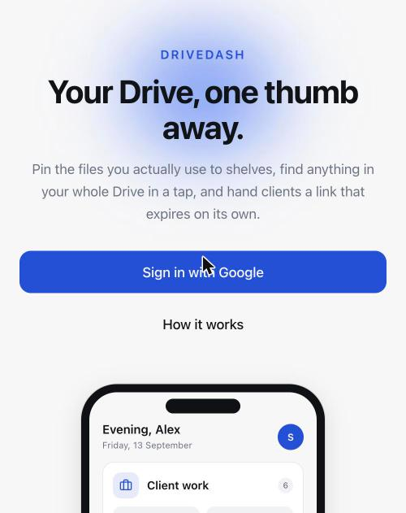
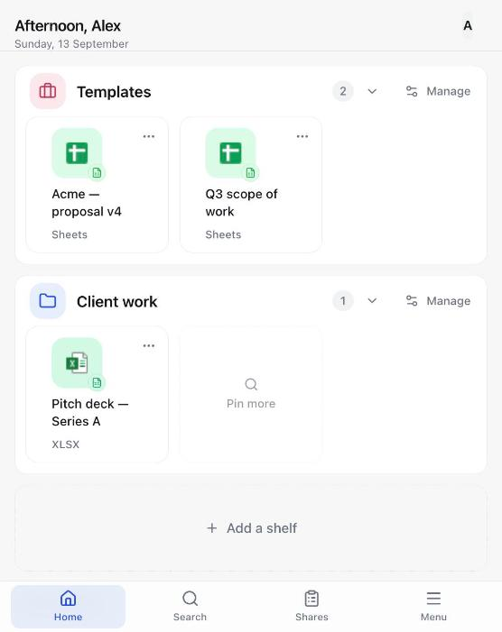
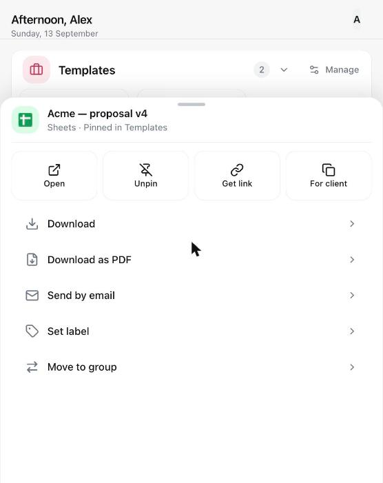
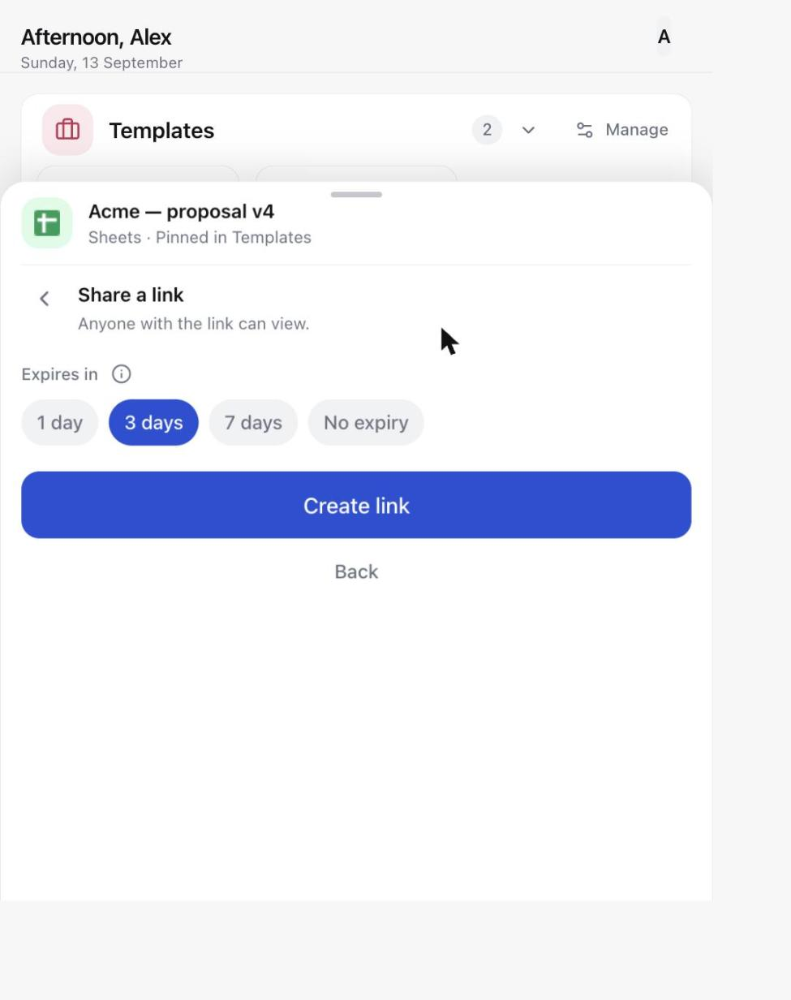
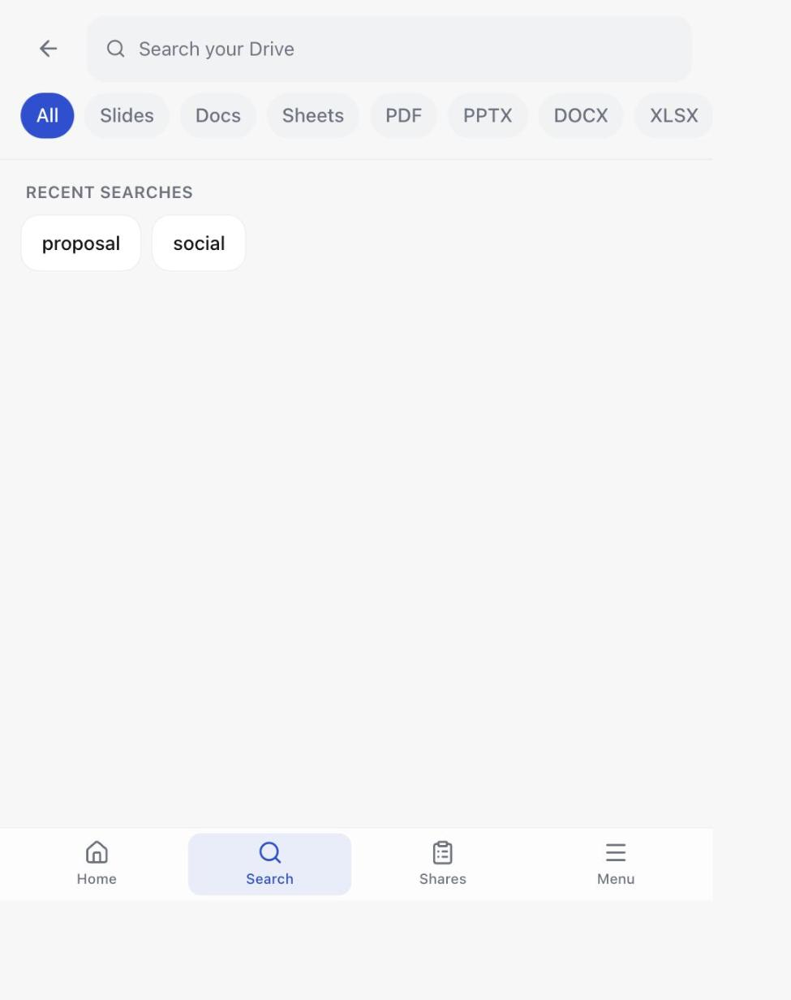
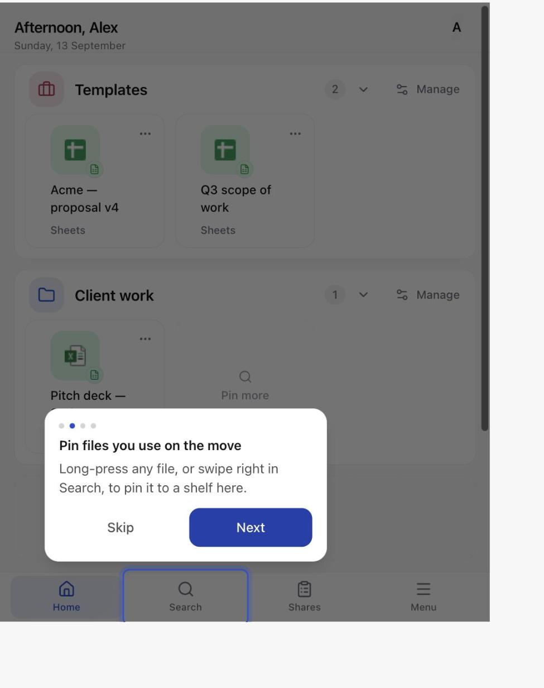
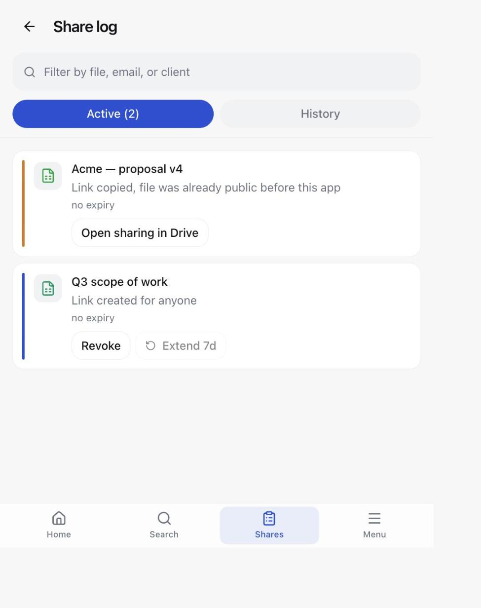
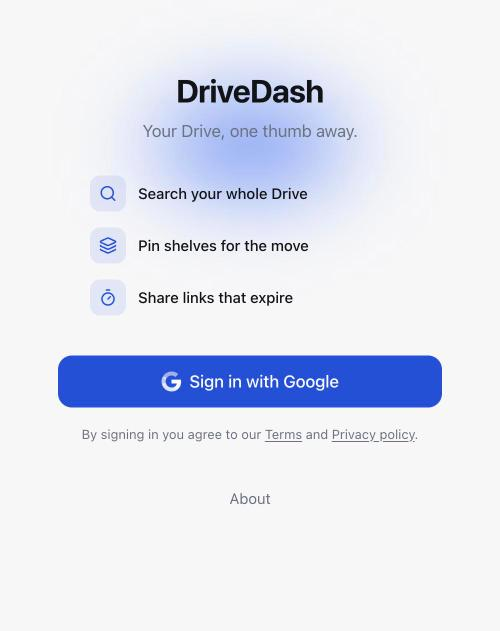

# DriveDash

A thin, mobile-first wrapper over Google Drive — pin the files you actually use, search your
whole Drive in a tap, and hand a client a share link that expires on its own.

<p align="center">
  
  
</p>

## What it does

- **Shelves** — pinned groups of files on the home screen, each with its own icon and colour.
  Long-press any file (or swipe in Search) to pin it to a shelf; reorder and rename shelves from
  **Manage**.
- **Search** — a dedicated Search tab over your whole Drive, with type chips (Docs, Sheets,
  Slides, PDF, PPTX, DOCX, XLSX) and recent searches.
- **Share links with expiry** — create a link that expires in 1, 3, or 7 days, or never. Expired
  links are revoked automatically the next time the app is opened (no background jobs).
- **Send by email** — share a file straight to someone's inbox with a short message, using
  Google's own sharing notification.
- **Copy for a client** — duplicate a file into `Client Shares/<Client>/` in your Drive so the
  original stays untouched.
- **Share log** — every link and email you've sent, active or expired, with one-tap revoke and
  extend.
- **Native share sheet + WhatsApp** — hand a link off to any app installed on the device.
- **First-run tour** — a short, skippable, re-launchable walkthrough for new users.
- **Installable PWA** — add it to your home screen; it behaves like a native app.
- **Open signup, hard cap** — anyone with a verified Google account can sign in, up to
  `MAX_USERS` seats. Admins manage the roster at `/admin/users`: block a user to disable sign-in
  without freeing their seat, remove a blocked user to free it.

## Screenshots

| | | |
|---|---|---|
|  |  |  |
| Home — pinned shelves | Long-press a file for actions | Share a link, with an expiry |
|  |  |  |
| Search your whole Drive | First-run guided tour | Share log — active links |
|  | | |
| Sign-in screen | | |

All screenshots use placeholder file names and a blank avatar; no real Drive content is shown.

## How it works / architecture

- **Next.js 16** (App Router), TypeScript strict, Tailwind v4, deployed to **Cloudflare Workers**
  via `@opennextjs/cloudflare` + `wrangler`.
- **Auth** — Auth.js v5, Google OAuth provider, JWT sessions (no database for sessions). Scopes:
  `drive` and `drive.appdata`. The access token never reaches the browser — pages and API routes
  read it server-side only.
- **Drive access** — plain `fetch` against the Drive v3 REST API (`src/lib/drive.ts`); no
  `googleapis` package. Every listing is scoped to `corpora=user` and `'me' in owners` — this app
  only ever sees files you own.
- **No database.** Your hot list (pinned shelves) and your share ledger (every link/email you've
  sent) live as JSON files in *your own* Drive `appDataFolder` — private storage Drive gives every
  app, invisible in your normal file list. The user registry (who's allowed to sign in, who's
  blocked) lives in a Cloudflare KV namespace with a small daily write budget, since KV's free tier
  caps out at 1,000 writes/day.
- **Never-delete rule.** The app never calls Drive's delete, trash, or empty-trash endpoints. The
  one exception is revoking a permission the app itself created when a link expires or you hit
  Revoke — `src/lib/drive.ts` is grepped by an automated test to enforce this.

For the full contract, data model, and API surface, see [`SPEC.md`](SPEC.md),
[`DESIGN_PLAN.md`](DESIGN_PLAN.md), [`IMPLEMENTATION_PLAN.md`](IMPLEMENTATION_PLAN.md), and the
working notes in [`docs/claude_memory/`](docs/claude_memory/). New to the codebase? Start with the
[session handoff](docs/HANDOFF-2026-09-13.md) and the infrastructure handoffs for
[Google Cloud](docs/infra/gcp-2026-09-13.md) and [Cloudflare](docs/infra/cloudflare-2026-09-13.md).

## Self-hosting

### Prerequisites

- Node 22 (required by `wrangler` and `@opennextjs/cloudflare`; `next dev`, tests, and lint work
  fine on Node 20).
- `pnpm`.
- A Google Cloud project with the **Drive API** enabled and an **OAuth client ID** (web
  application).
- A Cloudflare account with a KV namespace created for the user registry.

### Environment variables

| Variable | Purpose |
|---|---|
| `AUTH_SECRET` | Session encryption key — generate with `openssl rand -base64 32`. |
| `AUTH_GOOGLE_ID` | OAuth client ID from Google Cloud. |
| `AUTH_GOOGLE_SECRET` | OAuth client secret from Google Cloud. |
| `AUTH_URL` | The app's public URL (e.g. `http://localhost:3000` in dev, your Workers URL in prod). |
| `AUTH_TRUST_HOST` | `true` — required for Auth.js behind Cloudflare's proxy. |
| `ADMIN_EMAILS` | Comma-separated list of admin emails. Admins always get in and never count against the cap. |
| `MAX_USERS` | Hard cap on non-admin accounts. Positive integer, clamped 1–100, default 30. Set as a plain var in `wrangler.jsonc`, not a secret. |

Local Next.js dev reads `.env.local`; Wrangler (preview and deploy) reads `.dev.vars`. Keep the two
files in sync apart from `AUTH_URL` — `next dev` also loads `.dev.vars` and it takes precedence
over `.env.local`.

### Commands

```
pnpm install       # install dependencies
pnpm dev           # local dev server, http://localhost:3000
pnpm build         # production build
pnpm test          # vitest
pnpm run deploy    # build with OpenNext and deploy to Cloudflare Workers
```

Always use `pnpm run deploy`, not `pnpm deploy` — pnpm has a built-in command of that name that
shadows the script.

### Publishing the OAuth app

While your Google OAuth consent screen is in "Testing" mode, only accounts you've added as test
users can sign in, and refresh tokens expire after 7 days. To let anyone sign in and avoid weekly
re-authentication, submit the app for verification and publish it. Until it's verified, other
users will see Google's "unverified app" warning screen and have to click through it.

## Development

Before opening a PR: `pnpm lint`, `pnpm typecheck` (run `pnpm build` first — it generates types
`typecheck` depends on), and `pnpm test`. See [`src/components/ui/README.md`](src/components/ui/README.md)
for the design tokens and component primitives used throughout the UI, and
[`docs/claude_memory/`](docs/claude_memory/) for accumulated decisions, deploy notes, and gotchas
from past work on this codebase.

## Privacy

DriveDash only ever reads and writes files you own in your own Drive — see
[`/privacy`](https://drivedash.shubhammathur.in/privacy) for the full policy. In short: your
pinned shelves and share history are stored as JSON in your Drive's private `appDataFolder`, not
in any database DriveDash controls; the small user registry (email, admin/blocked status) lives in
Cloudflare KV; and the app never deletes or trashes a file.

## License

Personal project by Shubham Mathur. No license granted yet.
